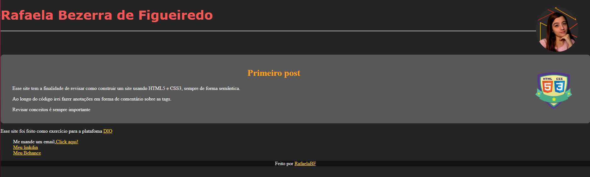

# Introdução a criação de websites 

Nesse curso o especialista vai contar um pouco sobre a história do HTML5 e do CSS3, explicar como funciona a estrutura básica dessas tecnologias, sua semântica, principais elementos e comandos.

## Layout do Site 💻
 

 

## Certificado 🏆
 

