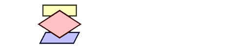

# Lógica de Programação Essencial 🤖 

Lógica de programação é a forma como o desenvolvedor entende a comunicação a fim de programar uma função de um programa. Faz uso de algoritmos, que são sequências de passos bem estabelecidos, como por exemplo, uma receita de bolo.

## Certificado 👩🏻‍🎓
 

 

## 👩🏻‍💻 Programas usados 
 
 &nbsp; 

